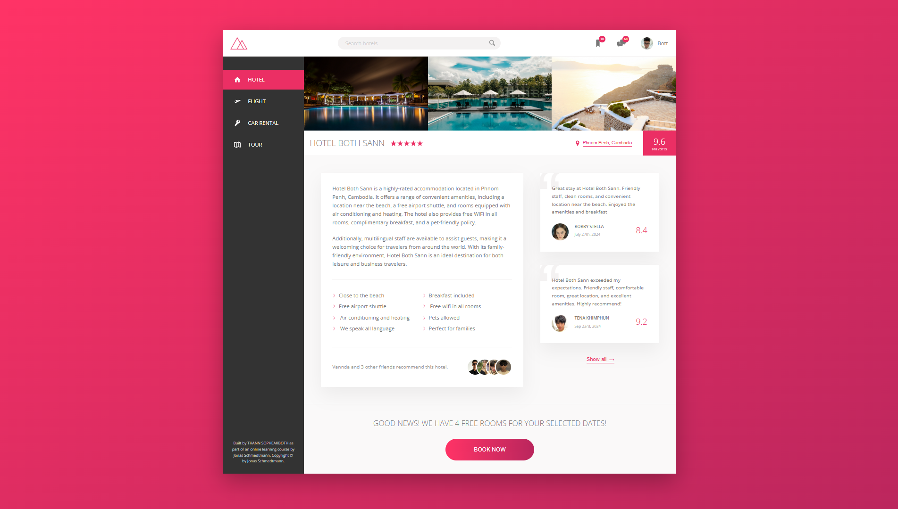
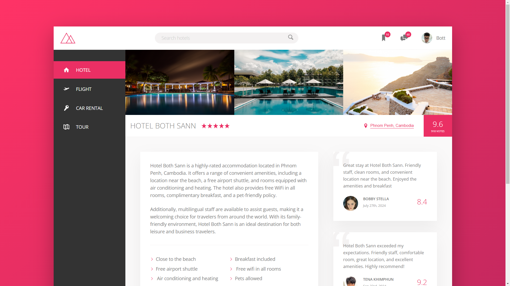
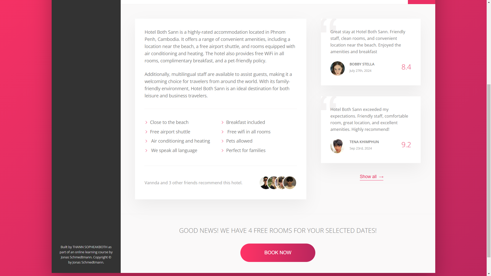

# Trillo: Your Ultimate Travel Companion ✈️ 🏨 🚗

Trillo is a fictional, modern travel booking platform where users can search and book hotels, flights, car rentals, and tours effortlessly. This project features a fully responsive design and highlights a user-friendly interface for an engaging travel booking experience.

## 🌐 Live Demo

Check out the live version of the website at: [trillo](https://bothsann.github.io/trillo-website/)

---

## 🖼️ Screenshots

### Screenshot 1


### Screenshot 2


### Screenshot 3


## 🌟 Features

- **Comprehensive Travel Services**: Search for hotels, book flights, rent cars, and plan tours all in one place.
- **Detailed Hotel Listings**: View hotels with key amenities, user reviews, ratings, and detailed descriptions.
- **Responsive Design**: Optimized for all devices, ensuring a seamless experience on desktops, tablets, and mobiles.
- **Sample Hotel**: "Hotel Both Sann" in Phnom Penh, Cambodia, with details including:
  - Close proximity to the beach
  - Free airport shuttle
  - Complimentary breakfast
  - Free WiFi and air-conditioned rooms
  - Pet-friendly policies
  - Multilingual staff for international travelers
  - Family-friendly environment
- **User Reviews**: Displayed with ratings and testimonials from past guests.

## 🎯 Purpose

This project demonstrates a travel booking platform, showcasing a modern layout, UI design, and responsive behavior. While the data is sample-based, it provides a realistic simulation of a functional travel app.

## 🛠️ Tech Stack

- **HTML5**: Semantic markup for structured content.
- **SASS (SCSS)**: Advanced CSS preprocessor used for modular, reusable, and maintainable styles.

## 🏗️ Installation & Setup

To view or modify this project locally:

1. Clone the repository:
   ```bash
   git clone https://github.com/BothSann/trillo-website.git

---

## 🛠️ Built By

This project was built by **THANN SOPHEAKBOTH** as part of an online learning course by [Jonas Schmedtmann](https://codingheroes.io/).

---

## ©️ Copyright By

© Copyright by **Jonas Schmedtmann**. This project is for educational purposes only and cannot be used for commercial purposes.
